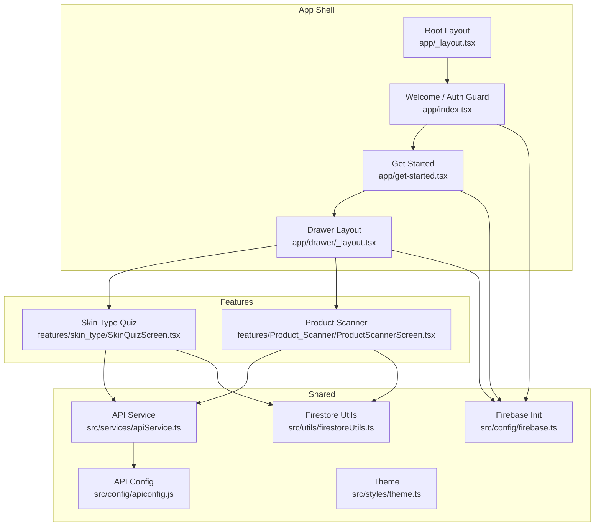
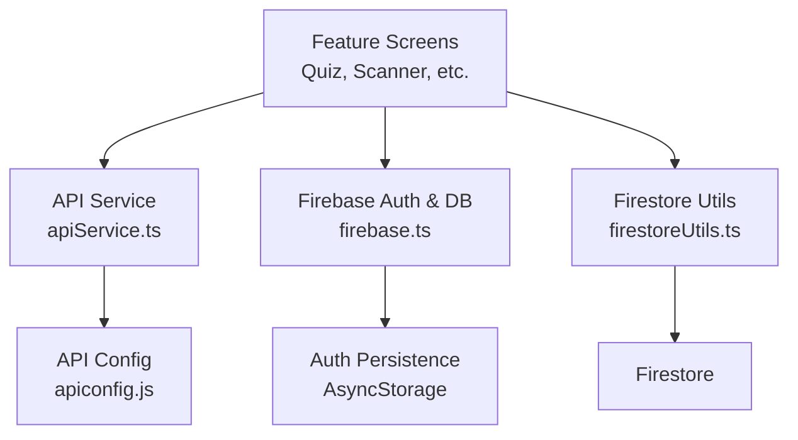
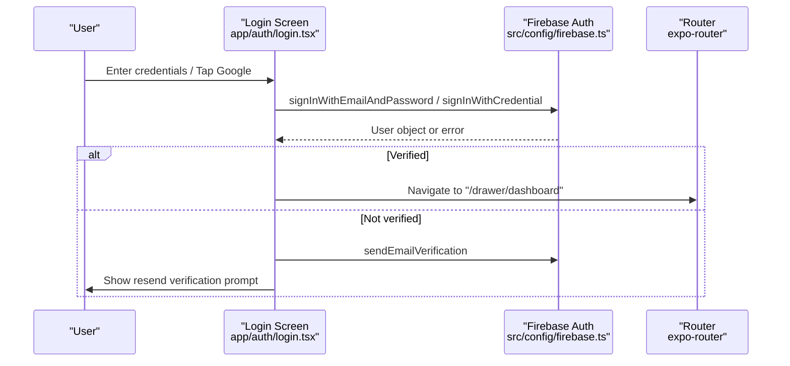
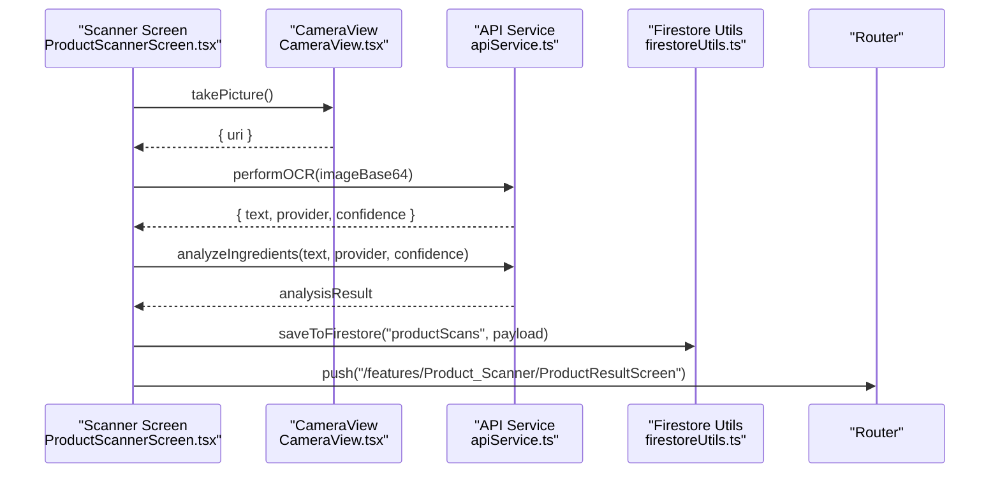
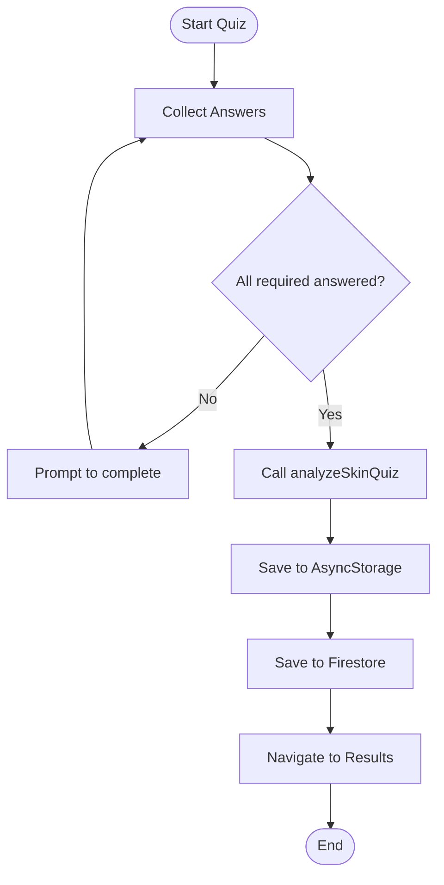
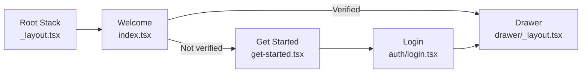
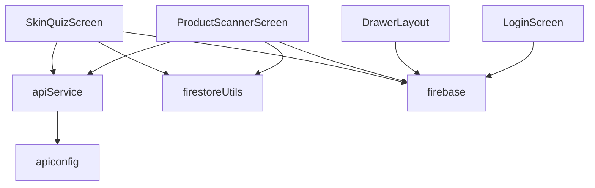

# Architecture Overview

<cite>
**Referenced Files in This Document**
- [app/_layout.tsx](file://app/_layout.tsx)
- [navigation/AppNavigator.js](file://navigation/AppNavigator.js)
- [src/config/firebase.ts](file://src/config/firebase.ts)
- [src/services/apiService.ts](file://src/services/apiService.ts)
- [src/config/apiconfig.js](file://src/config/apiconfig.js)
- [app/index.tsx](file://app/index.tsx)
- [app/get-started.tsx](file://app/get-started.tsx)
- [app/auth/login.tsx](file://app/auth/login.tsx)
- [app/drawer/_layout.tsx](file://app/drawer/_layout.tsx)
- [app/features/skin_type/SkinQuizScreen.tsx](file://app/features/skin_type/SkinQuizScreen.tsx)
- [app/features/Product_Scanner/ProductScannerScreen.tsx](file://app/features/Product_Scanner/ProductScannerScreen.tsx)
- [app/component/CameraView.tsx](file://app/component/CameraView.tsx)
- [src/utils/firestoreUtils.ts](file://src/utils/firestoreUtils.ts)
- [src/styles/theme.ts](file://src/styles/theme.ts)
</cite>

## Table of Contents
1. Introduction
2. Project Structure
3. Core Components
4. Architecture Overview
5. Detailed Component Analysis
6. Dependency Analysis
7. Performance Considerations
8. Troubleshooting Guide
9. Conclusion

## Introduction
This document describes the system architecture of DermaScanAI, a React Native/Expo application that provides AI-powered skincare insights. It explains the feature-sliced organization, service layer design, navigation structure using Expo Router and React Navigation, data flows between UI components, services, and external APIs (Firebase, OCR, weather), and security considerations for authentication and data protection. It also covers scalability and performance strategies to support growth and reliability.

## Project Structure
The app follows a feature-sliced pattern:
- Feature modules under app/features encapsulate domain-specific screens and logic (e.g., skin type quiz, product scanner).
- Shared infrastructure is centralized in src:
  - config: environment and Firebase initialization
  - services: HTTP client abstraction for backend APIs
  - utils: reusable helpers for Firestore, storage, notifications, routines
  - styles: theme, colors, typography, spacing
- App entry points and navigation live in app and navigation directories.
- Drawer-based navigation groups authenticated routes with a custom drawer content.

**Diagram sources**
- [app/_layout.tsx:1-13](file://app/_layout.tsx#L1-L13)
- [app/index.tsx:1-92](file://app/index.tsx#L1-L92)
- [app/get-started.tsx:1-204](file://app/get-started.tsx#L1-L204)
- [app/drawer/_layout.tsx:1-327](file://app/drawer/_layout.tsx#L1-L327)
- [app/features/skin_type/SkinQuizScreen.tsx:1-515](file://app/features/skin_type/SkinQuizScreen.tsx#L1-L515)
- [app/features/Product_Scanner/ProductScannerScreen.tsx:1-800](file://app/features/Product_Scanner/ProductScannerScreen.tsx#L1-L800)
- [src/services/apiService.ts:1-273](file://src/services/apiService.ts#L1-L273)
- [src/config/apiconfig.js:1-47](file://src/config/apiconfig.js#L1-L47)
- [src/config/firebase.ts:1-42](file://src/config/firebase.ts#L1-L42)
- [src/utils/firestoreUtils.ts:1-168](file://src/utils/firestoreUtils.ts#L1-L168)
- [src/styles/theme.ts:1-112](file://src/styles/theme.ts#L1-L112)

**Section sources**
- [app/_layout.tsx:1-13](file://app/_layout.tsx#L1-L13)
- [app/index.tsx:1-92](file://app/index.tsx#L1-L92)
- [app/get-started.tsx:1-204](file://app/get-started.tsx#L1-L204)
- [app/drawer/_layout.tsx:1-327](file://app/drawer/_layout.tsx#L1-L327)
- [src/config/firebase.ts:1-42](file://src/config/firebase.ts#L1-L42)
- [src/services/apiService.ts:1-273](file://src/services/apiService.ts#L1-L273)
- [src/config/apiconfig.js:1-47](file://src/config/apiconfig.js#L1-L47)
- [src/utils/firestoreUtils.ts:1-168](file://src/utils/firestoreUtils.ts#L1-L168)
- [src/styles/theme.ts:1-112](file://src/styles/theme.ts#L1-L112)

## Core Components
- Root layout and navigation shell:
  - Root layout wraps the app with safe area and a stack container.
  - Welcome screen checks authentication state and navigates to either the drawer dashboard or get-started flow.
  - Get started screen presents onboarding and login/signup options.
  - Drawer layout provides authenticated navigation and account actions.
- Feature modules:
  - Skin Type Quiz collects answers, calls the analysis API, persists results to Firestore and local storage, and navigates to results.
  - Product Scanner captures images via a camera component, performs OCR, analyzes ingredients, saves scans, and shows results.
- Shared services:
  - API service centralizes HTTP requests with timeouts, error handling, and typed responses for OCR, ingredient analysis, quiz, chatbot, weather, and disease endpoints.
  - API configuration sets base URLs per platform/environment and exposes endpoint builders.
  - Firebase initialization configures auth with persistence, Firestore, and Storage.
  - Firestore utilities provide user-scoped read/write operations and batch syncs.
- Theming:
  - Centralized color palette, typography, spacing, border radius, and shadows ensure consistent UI.

**Section sources**
- [app/_layout.tsx:1-13](file://app/_layout.tsx#L1-L13)
- [app/index.tsx:1-92](file://app/index.tsx#L1-L92)
- [app/get-started.tsx:1-204](file://app/get-started.tsx#L1-L204)
- [app/drawer/_layout.tsx:1-327](file://app/drawer/_layout.tsx#L1-L327)
- [app/features/skin_type/SkinQuizScreen.tsx:1-515](file://app/features/skin_type/SkinQuizScreen.tsx#L1-L515)
- [app/features/Product_Scanner/ProductScannerScreen.tsx:1-800](file://app/features/Product_Scanner/ProductScannerScreen.tsx#L1-L800)
- [src/services/apiService.ts:1-273](file://src/services/apiService.ts#L1-L273)
- [src/config/apiconfig.js:1-47](file://src/config/apiconfig.js#L1-L47)
- [src/config/firebase.ts:1-42](file://src/config/firebase.ts#L1-L42)
- [src/utils/firestoreUtils.ts:1-168](file://src/utils/firestoreUtils.ts#L1-L168)
- [src/styles/theme.ts:1-112](file://src/styles/theme.ts#L1-L112)

## Architecture Overview
DermaScanAI uses a layered architecture:
- Presentation layer: Feature screens and shared UI components.
- Service layer: apiService abstracts all backend calls; firebase.ts initializes SDKs; firestoreUtils handles data access.
- Configuration: apiconfig.js defines runtime endpoints and timeouts; theme.ts standardizes visuals.
- Navigation: Expo Router drives deep links and nested stacks; a legacy navigator file exists but the app primarily uses Expo Router.

**Diagram sources**
- [src/services/apiService.ts:1-273](file://src/services/apiService.ts#L1-L273)
- [src/config/apiconfig.js:1-47](file://src/config/apiconfig.js#L1-L47)
- [src/config/firebase.ts:1-42](file://src/config/firebase.ts#L1-L42)
- [src/utils/firestoreUtils.ts:1-168](file://src/utils/firestoreUtils.ts#L1-L168)

## Detailed Component Analysis

### Authentication Flow
The app guards routes based on Firebase auth state and supports email/password and Google Sign-In. Unverified users are prompted to verify their email before accessing protected areas.

**Diagram sources**
- [app/auth/login.tsx:1-413](file://app/auth/login.tsx#L1-L413)
- [src/config/firebase.ts:1-42](file://src/config/firebase.ts#L1-L42)

**Section sources**
- [app/auth/login.tsx:1-413](file://app/auth/login.tsx#L1-L413)
- [src/config/firebase.ts:1-42](file://src/config/firebase.ts#L1-L42)

### Product Scanner Data Flow
Captures an image, runs OCR, validates product type, analyzes ingredients, persists scan, and navigates to results.

**Diagram sources**
- [app/features/Product_Scanner/ProductScannerScreen.tsx:1-800](file://app/features/Product_Scanner/ProductScannerScreen.tsx#L1-L800)
- [app/component/CameraView.tsx:1-106](file://app/component/CameraView.tsx#L1-L106)
- [src/services/apiService.ts:1-273](file://src/services/apiService.ts#L1-L273)
- [src/utils/firestoreUtils.ts:1-168](file://src/utils/firestoreUtils.ts#L1-L168)

**Section sources**
- [app/features/Product_Scanner/ProductScannerScreen.tsx:1-800](file://app/features/Product_Scanner/ProductScannerScreen.tsx#L1-L800)
- [app/component/CameraView.tsx:1-106](file://app/component/CameraView.tsx#L1-L106)
- [src/services/apiService.ts:1-273](file://src/services/apiService.ts#L1-L273)
- [src/utils/firestoreUtils.ts:1-168](file://src/utils/firestoreUtils.ts#L1-L168)

### Skin Type Quiz Flow
Collects dynamic questions, sends answers to the analysis API, persists results locally and to Firestore, then navigates to results.

**Diagram sources**
- [app/features/skin_type/SkinQuizScreen.tsx:1-515](file://app/features/skin_type/SkinQuizScreen.tsx#L1-L515)
- [src/services/apiService.ts:1-273](file://src/services/apiService.ts#L1-L273)
- [src/utils/firestoreUtils.ts:1-168](file://src/utils/firestoreUtils.ts#L1-L168)

**Section sources**
- [app/features/skin_type/SkinQuizScreen.tsx:1-515](file://app/features/skin_type/SkinQuizScreen.tsx#L1-L515)
- [src/services/apiService.ts:1-273](file://src/services/apiService.ts#L1-L273)
- [src/utils/firestoreUtils.ts:1-168](file://src/utils/firestoreUtils.ts#L1-L168)

### Navigation Structure
- Root layout establishes a stack context.
- Welcome screen inspects auth state and redirects to either the drawer dashboard or get-started flow.
- Drawer layout provides authenticated navigation and account management.
- A legacy React Navigation stack exists but the app primarily uses Expo Router for routing.

**Diagram sources**
- [app/_layout.tsx:1-13](file://app/_layout.tsx#L1-L13)
- [app/index.tsx:1-92](file://app/index.tsx#L1-L92)
- [app/get-started.tsx:1-204](file://app/get-started.tsx#L1-L204)
- [app/auth/login.tsx:1-413](file://app/auth/login.tsx#L1-L413)
- [app/drawer/_layout.tsx:1-327](file://app/drawer/_layout.tsx#L1-L327)
- [navigation/AppNavigator.js:1-25](file://navigation/AppNavigator.js#L1-L25)

**Section sources**
- [app/_layout.tsx:1-13](file://app/_layout.tsx#L1-L13)
- [app/index.tsx:1-92](file://app/index.tsx#L1-L92)
- [app/get-started.tsx:1-204](file://app/get-started.tsx#L1-L204)
- [app/auth/login.tsx:1-413](file://app/auth/login.tsx#L1-L413)
- [app/drawer/_layout.tsx:1-327](file://app/drawer/_layout.tsx#L1-L327)
- [navigation/AppNavigator.js:1-25](file://navigation/AppNavigator.js#L1-L25)

### Separation of Concerns
- App screens: Feature modules own UI and orchestration; they do not implement network calls directly.
- Shared services: apiService encapsulates HTTP logic, timeouts, and error handling; firebase.ts manages SDK initialization; firestoreUtils centralizes data access.
- Configuration: apiconfig.js isolates environment-specific endpoints and timeouts; theme.ts centralizes visual tokens.
- Utilities: authUtils, notificationUtils, routineUtils, storageUtils provide cross-cutting helpers.

**Section sources**
- [src/services/apiService.ts:1-273](file://src/services/apiService.ts#L1-L273)
- [src/config/firebase.ts:1-42](file://src/config/firebase.ts#L1-L42)
- [src/config/apiconfig.js:1-47](file://src/config/apiconfig.js#L1-L47)
- [src/utils/firestoreUtils.ts:1-168](file://src/utils/firestoreUtils.ts#L1-L168)
- [src/styles/theme.ts:1-112](file://src/styles/theme.ts#L1-L112)

## Dependency Analysis
- Features depend on:
  - apiService for backend interactions (OCR, analysis, quiz, chatbot, weather, disease).
  - firestoreUtils for persistent storage and retrieval.
  - firebase auth for identity and session persistence.
- Services depend on:
  - apiconfig for base URLs, model API URL, timeouts, retry settings.
  - firebase SDKs for auth, Firestore, Storage.
- UI components depend on:
  - CameraView for camera permissions and capture.
  - Theme for consistent styling.

**Diagram sources**
- [app/features/skin_type/SkinQuizScreen.tsx:1-515](file://app/features/skin_type/SkinQuizScreen.tsx#L1-L515)
- [app/features/Product_Scanner/ProductScannerScreen.tsx:1-800](file://app/features/Product_Scanner/ProductScannerScreen.tsx#L1-L800)
- [src/services/apiService.ts:1-273](file://src/services/apiService.ts#L1-L273)
- [src/config/apiconfig.js:1-47](file://src/config/apiconfig.js#L1-L47)
- [src/utils/firestoreUtils.ts:1-168](file://src/utils/firestoreUtils.ts#L1-L168)
- [src/config/firebase.ts:1-42](file://src/config/firebase.ts#L1-L42)
- [app/drawer/_layout.tsx:1-327](file://app/drawer/_layout.tsx#L1-L327)
- [app/auth/login.tsx:1-413](file://app/auth/login.tsx#L1-L413)

**Section sources**
- [app/features/skin_type/SkinQuizScreen.tsx:1-515](file://app/features/skin_type/SkinQuizScreen.tsx#L1-L515)
- [app/features/Product_Scanner/ProductScannerScreen.tsx:1-800](file://app/features/Product_Scanner/ProductScannerScreen.tsx#L1-L800)
- [src/services/apiService.ts:1-273](file://src/services/apiService.ts#L1-L273)
- [src/config/apiconfig.js:1-47](file://src/config/apiconfig.js#L1-L47)
- [src/utils/firestoreUtils.ts:1-168](file://src/utils/firestoreUtils.ts#L1-L168)
- [src/config/firebase.ts:1-42](file://src/config/firebase.ts#L1-L42)
- [app/drawer/_layout.tsx:1-327](file://app/drawer/_layout.tsx#L1-L327)
- [app/auth/login.tsx:1-413](file://app/auth/login.tsx#L1-L413)

## Performance Considerations
- Network resilience:
  - Timeout enforcement and AbortController usage prevent hanging requests.
  - Retry attempts and delay configured in API config for robustness.
- Image processing:
  - Resize and compress images before OCR to reduce payload size and improve accuracy.
- Data persistence:
  - Batch writes for syncing multiple items efficiently.
  - Local-first patterns with AsyncStorage for quick access and offline readiness.
- Rendering:
  - Use native animations and avoid heavy re-renders in lists.
  - Defer non-critical work until after initial render.
- Security:
  - Enforce email verification before granting access to protected features.
  - Persist sessions securely using Firebase’s React Native persistence.

[No sources needed since this section provides general guidance]

## Troubleshooting Guide
- Authentication issues:
  - Invalid credentials or network errors are handled with user-friendly alerts.
  - Unverified accounts are redirected to verification prompts with resend capability.
- API failures:
  - Timeouts and non-OK responses are caught and surfaced to users with actionable messages.
  - Health check endpoint can be used to validate backend availability.
- Firestore errors:
  - Missing user context returns early to avoid unauthorized writes.
  - Errors are logged and gracefully degrade without crashing the UI.
- Camera issues:
  - Permission denied shows a clear message; capture errors are caught and retried.

**Section sources**
- [app/auth/login.tsx:1-413](file://app/auth/login.tsx#L1-L413)
- [src/services/apiService.ts:1-273](file://src/services/apiService.ts#L1-L273)
- [src/utils/firestoreUtils.ts:1-168](file://src/utils/firestoreUtils.ts#L1-L168)
- [app/component/CameraView.tsx:1-106](file://app/component/CameraView.tsx#L1-L106)

## Conclusion
DermaScanAI employs a clean, scalable architecture with feature-sliced modules, a dedicated service layer, and centralized configuration. Navigation leverages Expo Router with a drawer-based authenticated experience. Data flows from UI through a robust API service to backend endpoints and Firebase, with strong error handling and persistence strategies. The design supports future growth by isolating concerns, standardizing themes, and ensuring secure authentication and data protection.

[No sources needed since this section summarizes without analyzing specific files]