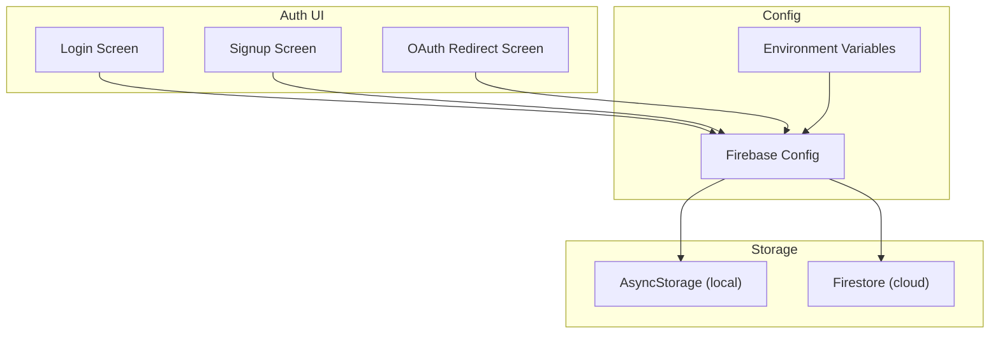
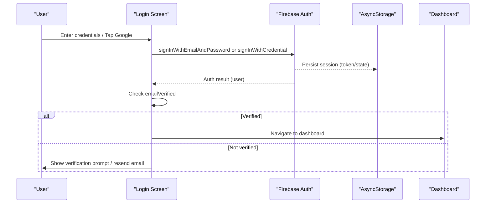
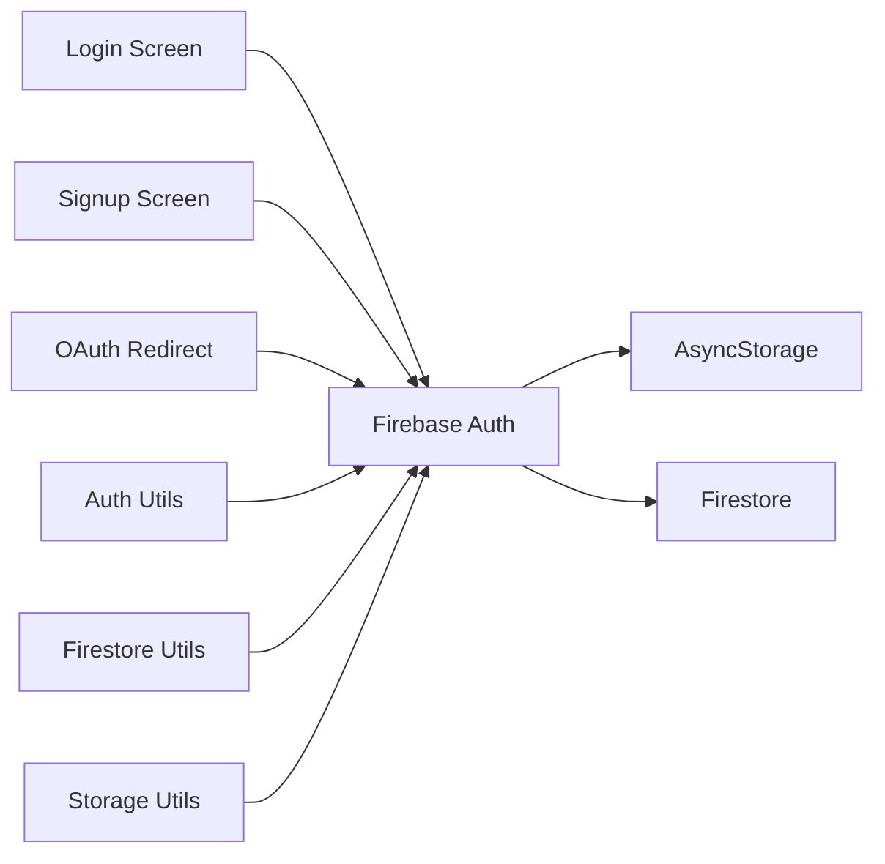

# Authentication & User Management

<cite>
**Referenced Files in This Document**
- [login.tsx](file://app/auth/login.tsx)
- [signup.tsx](file://app/auth/signup.tsx)
- [firebase.ts](file://src/config/firebase.ts)
- [env.ts](file://src/config/env.ts)
- [authUtils.ts](file://src/utils/authUtils.ts)
- [firestoreUtils.ts](file://src/utils/firestoreUtils.ts)
- [storageUtils.ts](file://src/utils/storageUtils.ts)
- [oauth2redirect.tsx](file://app/oauth2redirect.tsx)
- [dashboard.tsx](file://app/drawer/dashboard.tsx)
</cite>

## Table of Contents
1. [Introduction](#introduction)
2. [Project Structure](#project-structure)
3. [Core Components](#core-components)
4. [Architecture Overview](#architecture-overview)
5. [Detailed Component Analysis](#detailed-component-analysis)
6. [Dependency Analysis](#dependency-analysis)
7. [Performance Considerations](#performance-considerations)
8. [Troubleshooting Guide](#troubleshooting-guide)
9. [Conclusion](#conclusion)
10. [Appendices](#appendices)

## Introduction
This document explains DermaScanAI’s authentication and user management system built on Firebase Authentication with Google Sign-In, email/password flows, session persistence, and user data storage strategies. It covers OAuth2 redirect handling, token management via Firebase Auth, state management patterns, and security considerations relevant to healthcare-related applications. It also provides guidance for adding new providers, customizing flows, and handling errors.

## Project Structure
The authentication system spans UI screens, configuration, utilities, and storage layers:
- Authentication UI: Login and Signup screens implement email/password and Google Sign-In flows, verification handling, and navigation after successful auth.
- Configuration: Firebase is initialized once with persistent auth using AsyncStorage; environment variables centralize project credentials.
- Utilities: Helpers retrieve current user identity; Firestore and AsyncStorage utilities persist user-specific data securely scoped by user ID.
- Redirect: A dedicated screen completes the OAuth session when returning from external browsers.

**Diagram sources**
- [login.tsx:1-413](file://app/auth/login.tsx#L1-L413)
- [signup.tsx:1-482](file://app/auth/signup.tsx#L1-L482)
- [firebase.ts:1-42](file://src/config/firebase.ts#L1-L42)
- [env.ts:1-19](file://src/config/env.ts#L1-L19)
- [oauth2redirect.tsx:1-26](file://app/oauth2redirect.tsx#L1-L26)
- [firestoreUtils.ts:1-168](file://src/utils/firestoreUtils.ts#L1-L168)
- [storageUtils.ts:1-239](file://src/utils/storageUtils.ts#L1-L239)

**Section sources**
- [login.tsx:1-413](file://app/auth/login.tsx#L1-L413)
- [signup.tsx:1-482](file://app/auth/signup.tsx#L1-L482)
- [firebase.ts:1-42](file://src/config/firebase.ts#L1-L42)
- [env.ts:1-19](file://src/config/env.ts#L1-L19)
- [oauth2redirect.tsx:1-26](file://app/oauth2redirect.tsx#L1-L26)
- [firestoreUtils.ts:1-168](file://src/utils/firestoreUtils.ts#L1-L168)
- [storageUtils.ts:1-239](file://src/utils/storageUtils.ts#L1-L239)

## Core Components
- Firebase initialization and persistence: Initializes Firebase App once and sets up Auth with AsyncStorage-based persistence so users remain logged in across app restarts.
- Email/Password authentication: Login validates credentials, enforces email verification before granting access, supports password reset, and handles common error codes.
- Google Sign-In: Uses Expo Auth Session to obtain an id_token, creates a Google credential, signs in via Firebase, verifies email status, and navigates to protected routes.
- OAuth2 redirect completion: A lightweight screen finalizes the browser-based auth session and returns control to the app.
- User utilities: Helpers safely read current user identity for downstream operations.
- Data persistence: Firestore and AsyncStorage store user-scoped data using userId as a key or filter predicate.

**Section sources**
- [firebase.ts:1-42](file://src/config/firebase.ts#L1-L42)
- [login.tsx:114-196](file://app/auth/login.tsx#L114-L196)
- [signup.tsx:195-251](file://app/auth/signup.tsx#L195-L251)
- [oauth2redirect.tsx:1-26](file://app/oauth2redirect.tsx#L1-L26)
- [authUtils.ts:1-16](file://src/utils/authUtils.ts#L1-L16)
- [firestoreUtils.ts:1-168](file://src/utils/firestoreUtils.ts#L1-L168)
- [storageUtils.ts:1-239](file://src/utils/storageUtils.ts#L1-L239)

## Architecture Overview
The system follows a layered architecture:
- Presentation layer (screens) orchestrates user interactions and calls Firebase Auth APIs.
- Configuration layer initializes Firebase services and persists sessions locally.
- Storage layer manages local cache (AsyncStorage) and cloud documents (Firestore), always scoped to the authenticated user.

**Diagram sources**
- [login.tsx:114-196](file://app/auth/login.tsx#L114-L196)
- [firebase.ts:23-36](file://src/config/firebase.ts#L23-L36)

## Detailed Component Analysis

### Firebase Initialization and Persistence
- Single-app initialization prevents duplicate instances.
- Auth is initialized with React Native persistence backed by AsyncStorage to keep users signed in across sessions.
- Environment variables centralize Firebase configuration values.

Security notes:
- Credentials are loaded from environment variables rather than hard-coded.
- Persistence ensures seamless UX while keeping tokens secure at rest on device storage managed by Firebase SDK.

**Section sources**
- [firebase.ts:12-36](file://src/config/firebase.ts#L12-L36)
- [env.ts:5-18](file://src/config/env.ts#L5-L18)

### Login Flow (Email/Password + Google)
- Email/Password:
  - Validates inputs and attempts sign-in.
  - If email not verified, prompts to resend verification and logs out immediately.
  - Handles specific error codes (invalid credentials, invalid email, too many requests, network failures).
- Google Sign-In:
  - Uses Expo Auth Session with platform-specific client IDs and redirect scheme.
  - On success, builds a Google credential and signs in via Firebase.
  - Enforces email verification before allowing navigation to protected routes.
  - Handles account conflict and other provider errors gracefully.

Session management:
- Listens to auth state changes to auto-redirect verified users to the dashboard.
- Uses router.replace to avoid back-navigation loops.

**Section sources**
- [login.tsx:114-196](file://app/auth/login.tsx#L114-L196)
- [login.tsx:230-278](file://app/auth/login.tsx#L230-L278)
- [login.tsx:280-315](file://app/auth/login.tsx#L280-L315)

### Signup Flow (Email/Password + Google)
- Email/Password:
  - Strong validation for name, email, password strength, and confirmation.
  - Creates user and sends verification email.
  - Shows a modal guiding users to verify their email and offers resend with cooldown.
  - Polls verification status and redirects to login upon verification.
- Google Sign-Up:
  - Similar flow to login but used during signup; handles conflicts like existing accounts.

Error handling:
- Distinct alerts for email-already-in-use, weak passwords, invalid emails, and network issues.

**Section sources**
- [signup.tsx:43-74](file://app/auth/signup.tsx#L43-L74)
- [signup.tsx:195-251](file://app/auth/signup.tsx#L195-L251)
- [signup.tsx:304-345](file://app/auth/signup.tsx#L304-L345)
- [signup.tsx:347-362](file://app/auth/signup.tsx#L347-L362)

### OAuth2 Redirect Handling
- The redirect screen calls the web browser helper to complete the auth session and then displays a loading indicator until control returns to the app.

**Section sources**
- [oauth2redirect.tsx:1-26](file://app/oauth2redirect.tsx#L1-L26)

### User Identity Utilities
- Provide safe access to current user ID and email, with fallbacks when no user is logged in.

**Section sources**
- [authUtils.ts:1-16](file://src/utils/authUtils.ts#L1-L16)

### Data Persistence Strategy
- Firestore:
  - All writes include userId and timestamps; reads filter by userId to ensure isolation.
  - Batched writes improve efficiency when syncing multiple records.
- AsyncStorage:
  - Stores per-user lists keyed by userId (e.g., disease results, skin type results).
  - Provides quick local access to recent results and full details when available.

Privacy and security implications:
- Data is scoped to the authenticated user both locally and in the cloud.
- No PII beyond what is required is stored; sensitive health data should be minimized and handled according to compliance policies.

**Section sources**
- [firestoreUtils.ts:6-13](file://src/utils/firestoreUtils.ts#L6-L13)
- [firestoreUtils.ts:16-44](file://src/utils/firestoreUtils.ts#L16-L44)
- [firestoreUtils.ts:46-94](file://src/utils/firestoreUtils.ts#L46-L94)
- [storageUtils.ts:65-75](file://src/utils/storageUtils.ts#L65-L75)
- [storageUtils.ts:77-133](file://src/utils/storageUtils.ts#L77-L133)
- [storageUtils.ts:135-239](file://src/utils/storageUtils.ts#L135-L239)

### Protected Navigation and Dashboard
- After successful authentication and email verification, users are redirected to the dashboard.
- The dashboard uses local caching for non-auth features and demonstrates how authenticated context can be leveraged elsewhere in the app.

**Section sources**
- [login.tsx:114-123](file://app/auth/login.tsx#L114-L123)
- [dashboard.tsx:188-224](file://app/drawer/dashboard.tsx#L188-L224)

## Dependency Analysis
High-level dependencies between components:

**Diagram sources**
- [login.tsx:1-413](file://app/auth/login.tsx#L1-L413)
- [signup.tsx:1-482](file://app/auth/signup.tsx#L1-L482)
- [oauth2redirect.tsx:1-26](file://app/oauth2redirect.tsx#L1-L26)
- [firebase.ts:1-42](file://src/config/firebase.ts#L1-L42)
- [authUtils.ts:1-16](file://src/utils/authUtils.ts#L1-L16)
- [firestoreUtils.ts:1-168](file://src/utils/firestoreUtils.ts#L1-L168)
- [storageUtils.ts:1-239](file://src/utils/storageUtils.ts#L1-L239)

**Section sources**
- [firebase.ts:1-42](file://src/config/firebase.ts#L1-L42)
- [authUtils.ts:1-16](file://src/utils/authUtils.ts#L1-L16)
- [firestoreUtils.ts:1-168](file://src/utils/firestoreUtils.ts#L1-L168)
- [storageUtils.ts:1-239](file://src/utils/storageUtils.ts#L1-L239)

## Performance Considerations
- Use batch writes for bulk updates to Firestore to reduce round trips.
- Prefer router.replace over push for post-login navigation to prevent back-stack issues.
- Cache non-critical content locally (e.g., tips, messages) to minimize network calls.
- Debounce or throttle repeated actions such as verification polling to avoid excessive reloads.

[No sources needed since this section provides general guidance]

## Troubleshooting Guide
Common issues and resolutions:
- Email not verified:
  - Behavior: Login is blocked; user is prompted to verify or resend email.
  - Resolution: Resend verification email; wait for user to click link; poll verification status if needed.
- Account exists with different credential:
  - Behavior: Conflict when linking providers to same email.
  - Resolution: Prompt user to sign in with the original provider or follow provider-specific account linking flows.
- Too many requests:
  - Behavior: Rate limiting triggered by frequent attempts.
  - Resolution: Instruct user to retry later; consider exponential backoff in UI.
- Network errors:
  - Behavior: Requests fail due to connectivity issues.
  - Resolution: Show clear network error message; retry logic recommended.
- Weak password or invalid email:
  - Behavior: Validation fails during signup.
  - Resolution: Update input to meet requirements; show inline feedback.

Operational tips:
- Ensure correct client IDs and redirect schemes for each platform.
- Verify that WebBrowser.maybeCompleteAuthSession is called on the redirect screen.
- Confirm environment variables are set correctly for Firebase initialization.

**Section sources**
- [login.tsx:153-196](file://app/auth/login.tsx#L153-L196)
- [login.tsx:230-278](file://app/auth/login.tsx#L230-L278)
- [signup.tsx:224-251](file://app/auth/signup.tsx#L224-L251)
- [signup.tsx:304-345](file://app/auth/signup.tsx#L304-L345)
- [oauth2redirect.tsx:1-26](file://app/oauth2redirect.tsx#L1-L26)

## Conclusion
DermaScanAI implements a robust, secure authentication system using Firebase Auth with persistent sessions and comprehensive error handling. Email verification protects sensitive workflows, while Google Sign-In streamlines onboarding. Data is consistently scoped to the authenticated user across local and cloud storage. For healthcare contexts, ensure minimal data collection, encryption in transit and at rest, strict access controls, and compliance with applicable regulations.

[No sources needed since this section summarizes without analyzing specific files]

## Appendices

### Adding a New Authentication Provider
Steps to integrate a new provider (e.g., Apple, Facebook):
- Configure provider credentials in your Firebase console and environment variables.
- In Login/Signup screens, add provider-specific UI and call the appropriate sign-in method.
- Handle the provider’s response and create a Firebase credential.
- Enforce email verification and navigate to protected routes upon success.
- Add error handling for provider-specific codes and edge cases.

Reference patterns:
- Google Sign-In setup and credential creation.
- Response handling and navigation.

**Section sources**
- [login.tsx:125-196](file://app/auth/login.tsx#L125-L196)
- [signup.tsx:195-251](file://app/auth/signup.tsx#L195-L251)

### Customizing Authentication Flows
- Require additional profile fields post-signup before granting full access.
- Implement role-based routing after login based on user attributes stored in Firestore.
- Add multi-factor authentication by integrating Firebase MFA flows.

[No sources needed since this section provides general guidance]

### Security and Compliance Considerations for Healthcare Applications
- Encryption in transit: Firebase services use TLS for all communications.
- Encryption at rest: Firebase stores data encrypted at rest.
- Least privilege: Scope Firestore rules to allow only authenticated users to access their own data.
- Data minimization: Collect only necessary personal and health-related information.
- Consent and transparency: Inform users about data usage and provide mechanisms to delete data.
- Audit and monitoring: Log security events and monitor for anomalies.
- Compliance: Align with HIPAA/GDPR where applicable; consult legal counsel for deployment.

[No sources needed since this section provides general guidance]