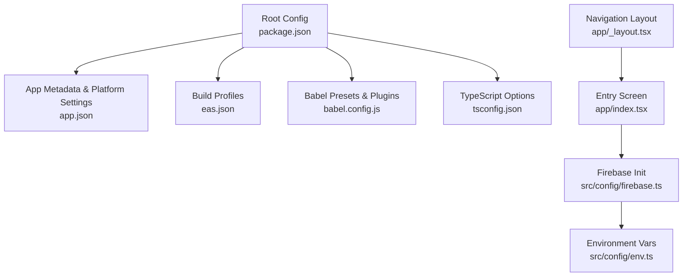
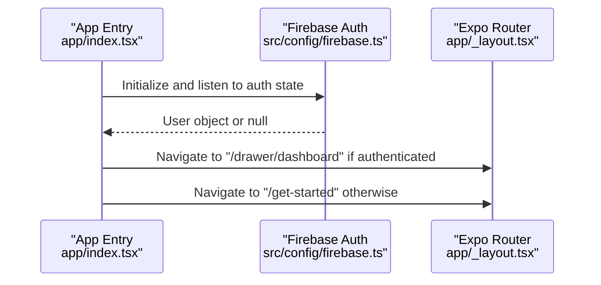
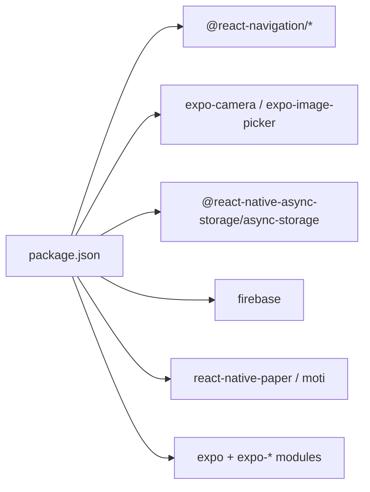

# Getting Started

<cite>
**Referenced Files in This Document**
- [package.json](file://package.json)
- [app.json](file://app.json)
- [eas.json](file://eas.json)
- [babel.config.js](file://babel.config.js)
- [tsconfig.json](file://tsconfig.json)
- [README.md](file://README.md)
- [app/_layout.tsx](file://app/_layout.tsx)
- [app/index.tsx](file://app/index.tsx)
- [src/config/firebase.ts](file://src/config/firebase.ts)
- [src/config/env.ts](file://src/config/env.ts)
</cite>

## Table of Contents
1. Introduction
2. Project Structure
3. Core Components
4. Architecture Overview
5. Detailed Component Analysis
6. Dependency Analysis
7. Performance Considerations
8. Troubleshooting Guide
9. Conclusion
10. Appendices

## Introduction
This guide helps you set up and run DermaScanAI locally for development. It covers prerequisites, environment setup, installing dependencies, starting the development server, running on Android and iOS simulators/emulators, using Expo Go for quick testing, creating development builds, and basic troubleshooting. It also explains the initial project structure and provides a first workflow to get productive quickly.

## Project Structure
DermaScanAI is an Expo Router-based React Native app with TypeScript. The key directories and files relevant to getting started are:
- app/: File-based routes and root layout for navigation
- src/: Shared configuration (Firebase, environment variables), services, styles, and utilities
- assets/images: App icons and images referenced by the app
- Root config files: package.json, app.json, eas.json, babel.config.js, tsconfig.json

**Diagram sources**
- [package.json:1-12](file://package.json#L1-L12)
- [app.json:1-97](file://app.json#L1-L97)
- [eas.json:1-37](file://eas.json#L1-L37)
- [babel.config.js:1-5](file://babel.config.js#L1-L5)
- [tsconfig.json:1-16](file://tsconfig.json#L1-L16)
- [app/_layout.tsx:1-13](file://app/_layout.tsx#L1-L13)
- [app/index.tsx:1-92](file://app/index.tsx#L1-L92)
- [src/config/firebase.ts:1-42](file://src/config/firebase.ts#L1-L42)
- [src/config/env.ts:1-19](file://src/config/env.ts#L1-L19)

**Section sources**
- [package.json:1-12](file://package.json#L1-L12)
- [app.json:1-97](file://app.json#L1-L97)
- [eas.json:1-37](file://eas.json#L1-L37)
- [babel.config.js:1-5](file://babel.config.js#L1-L5)
- [tsconfig.json:1-16](file://tsconfig.json#L1-L16)
- [README.md:5-26](file://README.md#L5-L26)

## Core Components
- Development scripts: start, android, ios, web, lint
- Expo Router file-based routing with a root Stack layout
- Firebase integration with persistent auth via AsyncStorage
- Environment variable management for Firebase and API endpoints
- EAS build profiles for development, preview, and production

Key implementation references:
- Scripts and dependency versions: [package.json:5-12](file://package.json#L5-L12), [package.json:13-82](file://package.json#L13-L82)
- App metadata and platform settings: [app.json:1-97](file://app.json#L1-L97)
- Build profiles: [eas.json:1-37](file://eas.json#L1-L37)
- Navigation root: [app/_layout.tsx:1-13](file://app/_layout.tsx#L1-L13)
- Entry screen and auth flow: [app/index.tsx:1-92](file://app/index.tsx#L1-L92)
- Firebase initialization and persistence: [src/config/firebase.ts:1-42](file://src/config/firebase.ts#L1-L42)
- Environment variables: [src/config/env.ts:1-19](file://src/config/env.ts#L1-L19)

**Section sources**
- [package.json:5-12](file://package.json#L5-L12)
- [app.json:1-97](file://app.json#L1-L97)
- [eas.json:1-37](file://eas.json#L1-L37)
- [app/_layout.tsx:1-13](file://app/_layout.tsx#L1-L13)
- [app/index.tsx:1-92](file://app/index.tsx#L1-L92)
- [src/config/firebase.ts:1-42](file://src/config/firebase.ts#L1-L42)
- [src/config/env.ts:1-19](file://src/config/env.ts#L1-L19)

## Architecture Overview
At runtime, the app initializes Firebase and checks authentication state to route users appropriately. The entry screen waits briefly, then navigates to either the dashboard or the get-started flow based on auth status.

**Diagram sources**
- [app/index.tsx:19-38](file://app/index.tsx#L19-L38)
- [src/config/firebase.ts:23-41](file://src/config/firebase.ts#L23-L41)
- [app/_layout.tsx:6-12](file://app/_layout.tsx#L6-L12)

## Detailed Component Analysis

### Prerequisites and Environment Setup
- Node.js and npm: Use a recent LTS version compatible with Expo SDK 54 and React Native 0.81. Verify your Node version before proceeding.
- Expo CLI: Installed automatically via npx when running commands; no global install required.
- Android development:
  - Install Android Studio and set up the Android SDK/Emulator.
  - Ensure JAVA_HOME points to a JDK compatible with your setup.
- iOS development:
  - macOS required with Xcode installed and command-line tools configured.
  - Set up a signing certificate and provisioning profile for local builds.
- Environment variables:
  - Create a .env file at the project root with EXPO_PUBLIC_ prefixed keys for Firebase and model API endpoints.
  - Required keys include FIREBASE_API_KEY, FIREBASE_AUTH_DOMAIN, FIREBASE_PROJECT_ID, FIREBASE_STORAGE_BUCKET, FIREBASE_MESSAGING_SENDER_ID, FIREBASE_APP_ID, FIREBASE_MEASUREMENT_ID, COMPUTER_IP, MODEL_API_URL.
  - These values are consumed by the environment module and passed into Firebase initialization.

References:
- Environment consumption: [src/config/env.ts:5-18](file://src/config/env.ts#L5-L18)
- Firebase initialization using env: [src/config/firebase.ts:12-21](file://src/config/firebase.ts#L12-L21)

**Section sources**
- [src/config/env.ts:5-18](file://src/config/env.ts#L5-L18)
- [src/config/firebase.ts:12-21](file://src/config/firebase.ts#L12-L21)

### Installation and First Run
1. Install dependencies:
   - Run npm install to install all packages defined in package.json.
2. Start the development server:
   - Run npx expo start to launch Metro and open the Expo DevTools.
3. Choose a target:
   - Open in a development build, Android emulator, iOS simulator, or Expo Go (limited capabilities).

References:
- Scripts: [package.json:5-12](file://package.json#L5-L12)
- Quick start instructions: [README.md:5-26](file://README.md#L5-L26)

**Section sources**
- [package.json:5-12](file://package.json#L5-L12)
- [README.md:5-26](file://README.md#L5-L26)

### Running on Android Emulator
- Ensure the Android emulator is running or start it from Android Studio.
- From the Expo DevTools, select “Run on Android device/emulator”.
- If building locally, ensure platform-specific toolchains are installed and configured.

References:
- Android script: [package.json:8-8](file://package.json#L8-L8)
- App metadata includes Android permissions and Google Services: [app.json:36-70](file://app.json#L36-L70)

**Section sources**
- [package.json:8-8](file://package.json#L8-L8)
- [app.json:36-70](file://app.json#L36-L70)

### Running on iOS Simulator
- Ensure Xcode and iOS toolchain are installed.
- From the Expo DevTools, select “Run on iOS simulator”.
- For local builds, configure signing and certificates as required by Apple.

References:
- iOS script: [package.json:9-9](file://package.json#L9-L9)
- App metadata includes iOS bundle identifier and Google Services: [app.json:12-35](file://app.json#L12-L35)

**Section sources**
- [package.json:9-9](file://package.json#L9-L9)
- [app.json:12-35](file://app.json#L12-L35)

### Using Expo Go for Quick Testing
- Expo Go allows rapid iteration without native builds but has limitations for certain native modules.
- Some features like camera, notifications, and deep linking may require a custom development build.

References:
- Quick start mentions Expo Go: [README.md:19-25](file://README.md#L19-L25)

**Section sources**
- [README.md:19-25](file://README.md#L19-L25)

### Creating a Development Build
Use EAS to create a development build that includes native capabilities needed by the app.

Steps:
1. Install and log in to EAS CLI.
2. Configure project ID in app.json extra.eas.projectId.
3. Build a development client:
   - Android: eas build --profile development
   - iOS: eas build --profile development
4. Install the development client on your device or simulator and run the app with npx expo start.

References:
- EAS CLI version requirement: [eas.json:1-4](file://eas.json#L1-L4)
- Development build profile: [eas.json:5-15](file://eas.json#L5-L15)
- Project ID: [app.json:84-88](file://app.json#L84-L88)

**Section sources**
- [eas.json:1-15](file://eas.json#L1-L15)
- [app.json:84-88](file://app.json#L84-L88)

### Initial Project Structure and First Workflow
- app/_layout.tsx defines the root navigation container with a Stack and SafeAreaProvider.
- app/index.tsx is the entry screen that checks authentication and navigates accordingly.
- src/config/firebase.ts initializes Firebase and sets up persistent auth with AsyncStorage.
- src/config/env.ts centralizes environment variables used by Firebase and API calls.

First workflow for contributors:
1. Add environment variables to .env as described above.
2. Run npm install and npx expo start.
3. Test on Android or iOS simulator/emulator or use Expo Go for quick checks.
4. Edit screens under app/ to implement new features.
5. Use the existing navigation patterns and Firebase utilities for data and auth flows.

References:
- Root layout: [app/_layout.tsx:1-13](file://app/_layout.tsx#L1-L13)
- Entry screen logic: [app/index.tsx:19-38](file://app/index.tsx#L19-L38)
- Firebase init and persistence: [src/config/firebase.ts:23-41](file://src/config/firebase.ts#L23-L41)
- Env access: [src/config/env.ts:5-18](file://src/config/env.ts#L5-L18)

**Section sources**
- [app/_layout.tsx:1-13](file://app/_layout.tsx#L1-L13)
- [app/index.tsx:19-38](file://app/index.tsx#L19-L38)
- [src/config/firebase.ts:23-41](file://src/config/firebase.ts#L23-L41)
- [src/config/env.ts:5-18](file://src/config/env.ts#L5-L18)

## Dependency Analysis
The app relies on Expo and a rich ecosystem of native modules. Key categories:
- Navigation: @react-navigation/* packages
- Media and sensors: expo-camera, expo-image-picker, expo-sensors
- Storage and persistence: @react-native-async-storage/async-storage
- Firebase: firebase (auth, firestore, storage)
- UI and animations: react-native-paper, moti, react-native-reanimated
- Utilities: base-64, next (for web), various Expo modules

**Diagram sources**
- [package.json:13-82](file://package.json#L13-L82)

**Section sources**
- [package.json:13-82](file://package.json#L13-L82)

## Performance Considerations
- Keep the number of heavy native modules minimal; prefer Expo-managed modules where possible.
- Avoid unnecessary re-renders in screens; leverage memoization and proper state management.
- Use efficient image handling and caching strategies for media-heavy features.
- Profile JavaScript execution and native bridge usage during development.

[No sources needed since this section provides general guidance]

## Troubleshooting Guide
Common issues and resolutions:
- Missing environment variables:
  - Ensure .env contains all EXPO_PUBLIC_* keys referenced in src/config/env.ts.
  - Restart the dev server after adding or changing environment variables.
- Firebase initialization errors:
  - Verify Firebase credentials are correct and match your project.
  - Confirm that the app uses the same project across platforms.
- Android/iOS build failures:
  - Check platform toolchains (Android SDK/JDK, Xcode) and signing configurations.
  - Review logs from the build process for specific error messages.
- Expo Go limitations:
  - Some features require a development build; use EAS to create one.
- Reanimated plugin:
  - Ensure babel.config.js includes the reanimated plugin preset.

References:
- Environment variables: [src/config/env.ts:5-18](file://src/config/env.ts#L5-L18)
- Firebase initialization: [src/config/firebase.ts:12-41](file://src/config/firebase.ts#L12-L41)
- Reanimated plugin: [babel.config.js:1-5](file://babel.config.js#L1-L5)

**Section sources**
- [src/config/env.ts:5-18](file://src/config/env.ts#L5-L18)
- [src/config/firebase.ts:12-41](file://src/config/firebase.ts#L12-L41)
- [babel.config.js:1-5](file://babel.config.js#L1-L5)

## Conclusion
You now have everything needed to set up, run, and develop DermaScanAI locally. Follow the prerequisites, configure environment variables, install dependencies, and start the development server. Use Expo Go for quick tests and EAS for full-featured development builds. Refer to the troubleshooting tips if you encounter common setup issues.

[No sources needed since this section summarizes without analyzing specific files]

## Appendices

### Quick Commands Reference
- Install dependencies: npm install
- Start dev server: npx expo start
- Run on Android: npx expo run:android
- Run on iOS: npx expo run:ios
- Web: npx expo start --web

References:
- Scripts: [package.json:5-12](file://package.json#L5-L12)

**Section sources**
- [package.json:5-12](file://package.json#L5-L12)