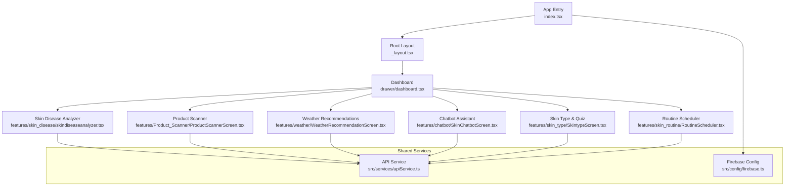
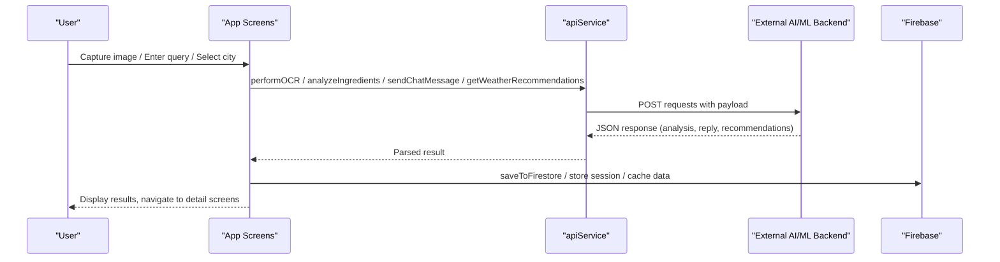
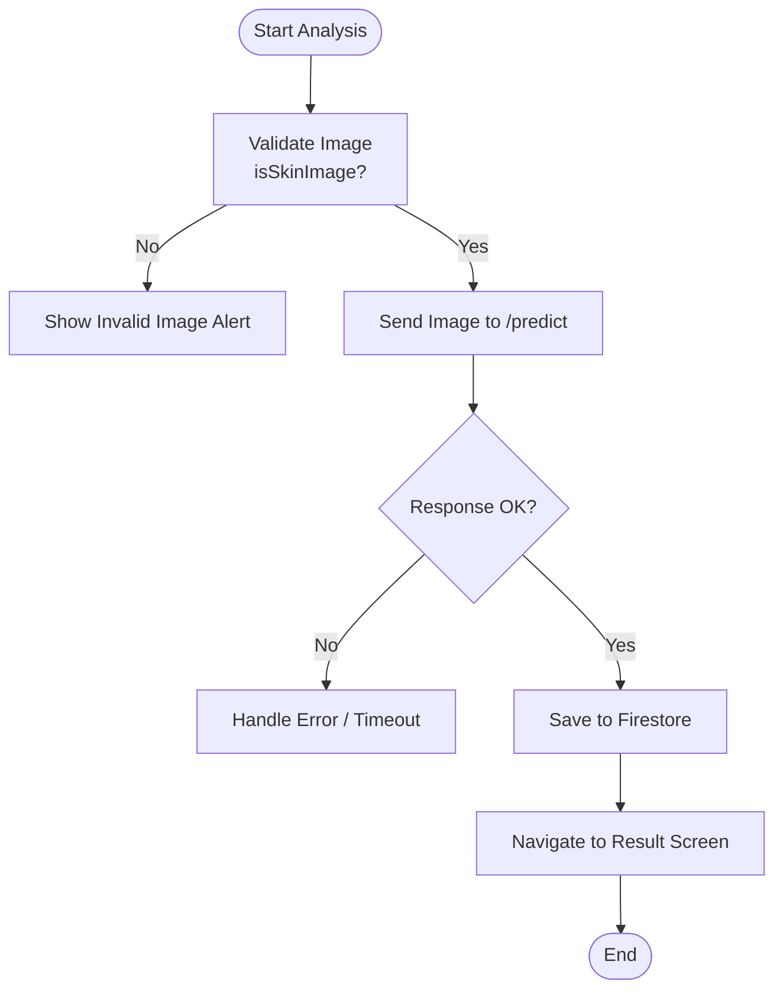
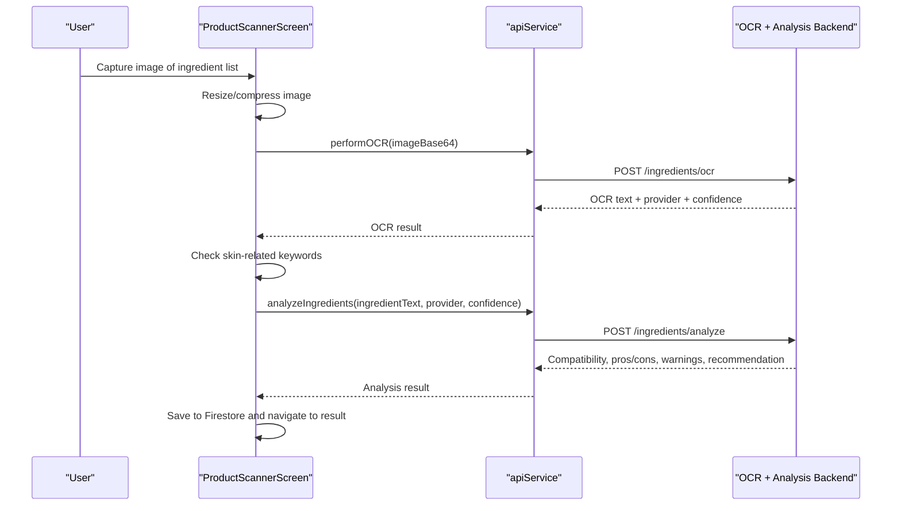
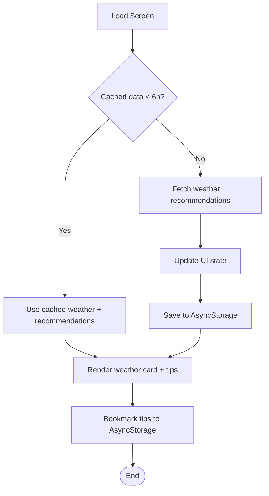
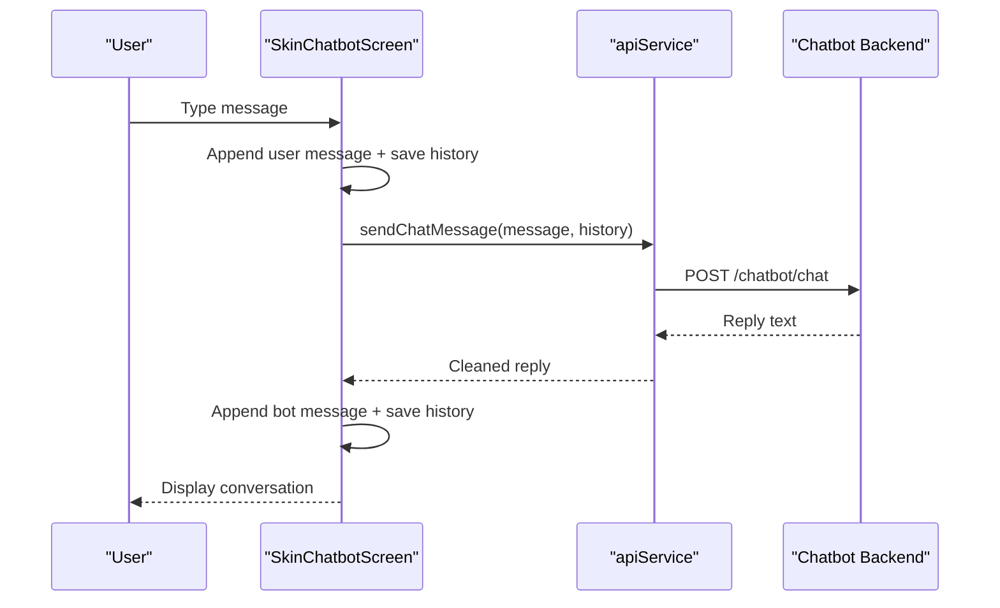
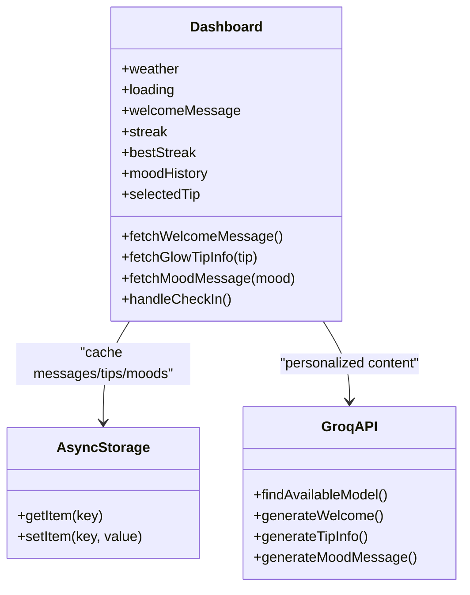
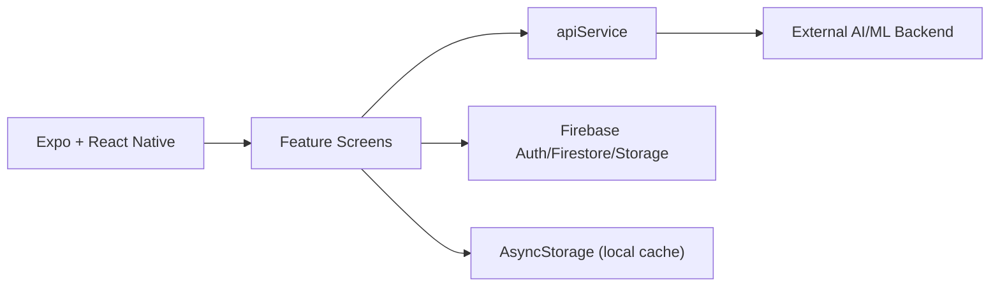

# Project Overview

<cite>
**Referenced Files in This Document**
- [README.md](file://README.md)
- [package.json](file://package.json)
- [app/index.tsx](file://app/index.tsx)
- [app/_layout.tsx](file://app/_layout.tsx)
- [src/config/firebase.ts](file://src/config/firebase.ts)
- [src/services/apiService.ts](file://src/services/apiService.ts)
- [app/features/skin_disease/skindiseaseanalyzer.tsx](file://app/features/skin_disease/skindiseaseanalyzer.tsx)
- [app/features/Product_Scanner/ProductScannerScreen.tsx](file://app/features/Product_Scanner/ProductScannerScreen.tsx)
- [app/features/weather/WeatherRecommendationScreen.tsx](file://app/features/weather/WeatherRecommendationScreen.tsx)
- [app/features/chatbot/SkinChatbotScreen.tsx](file://app/features/chatbot/SkinChatbotScreen.tsx)
- [app/drawer/dashboard.tsx](file://app/drawer/dashboard.tsx)
- [app/features/skin_type/SkintypeScreen.tsx](file://app/features/skin_type/SkintypeScreen.tsx)
- [app/features/skin_routine/RoutineScheduler.tsx](file://app/features/skin_routine/RoutineScheduler.tsx)
</cite>

## Table of Contents
1. Introduction
2. Project Structure
3. Core Components
4. Architecture Overview
5. Detailed Component Analysis
6. Dependency Analysis
7. Performance Considerations
8. Troubleshooting Guide
9. Conclusion

## Introduction
DermaScanAI is an AI-powered skincare analysis mobile application that transforms traditional dermatological consultations into accessible, digital experiences. Its core mission is to provide practical, evidence-based skincare guidance through technology—helping users understand their skin, detect potential conditions, evaluate product ingredients, receive weather-aware recommendations, and interact with an intelligent chatbot assistant. The app targets skincare enthusiasts and individuals seeking professional-grade skin analysis without the need for immediate clinical visits.

Key features include:
- Skin disease detection via image capture and AI validation
- Product ingredient scanning using OCR and AI analysis
- Weather-based personalized skincare recommendations
- Interactive chatbot assistance for daily skincare questions
- Skin type assessment and routine scheduling with reminders

Technology stack overview:
- React Native with Expo framework for cross-platform development
- Firebase integration for authentication, storage, and cloud data persistence
- AI/ML capabilities via external APIs for OCR, ingredient analysis, chatbot responses, and weather insights
- Modern UI components, animations, and responsive layouts

How it works at a high level:
- Users authenticate and access a dashboard that routes them to feature modules
- Each module captures input (images, text, or preferences), processes it through AI services, and returns actionable results
- Results are saved locally and optionally synced to the cloud for continuity across sessions

**Section sources**
- [README.md:1-51](file://README.md#L1-L51)
- [package.json:1-85](file://package.json#L1-L85)
- [app/index.tsx:1-92](file://app/index.tsx#L1-L92)

## Project Structure
The project follows a feature-based organization within an Expo Router structure:
- app/: Feature screens and routing entry points
  - features/: Individual modules (skin disease, product scanner, weather, chatbot, skin type, routines)
  - drawer/: Navigation shell and dashboard
  - component/: Shared UI components like camera view
  - data/: Static datasets (diseases, quiz questions, skin types)
- src/: Cross-cutting concerns
  - config/: Environment and service configuration (Firebase)
  - services/: API client abstraction
  - styles/: Theme and reusable styles
  - utils(): Utilities for auth, notifications, storage, and Firestore sync
- navigation/: App-level navigation setup

**Diagram sources**
- [app/index.tsx:1-92](file://app/index.tsx#L1-L92)
- [app/_layout.tsx:1-13](file://app/_layout.tsx#L1-L13)
- [app/drawer/dashboard.tsx:188-330](file://app/drawer/dashboard.tsx#L188-L330)
- [app/features/skin_disease/skindiseaseanalyzer.tsx:171-262](file://app/features/skin_disease/skindiseaseanalyzer.tsx#L171-L262)
- [app/features/Product_Scanner/ProductScannerScreen.tsx:188-257](file://app/features/Product_Scanner/ProductScannerScreen.tsx#L188-L257)
- [app/features/weather/WeatherRecommendationScreen.tsx:132-183](file://app/features/weather/WeatherRecommendationScreen.tsx#L132-L183)
- [app/features/chatbot/SkinChatbotScreen.tsx:198-256](file://app/features/chatbot/SkinChatbotScreen.tsx#L198-L256)
- [src/services/apiService.ts:112-273](file://src/services/apiService.ts#L112-L273)
- [src/config/firebase.ts:1-42](file://src/config/firebase.ts#L1-L42)

**Section sources**
- [app/index.tsx:1-92](file://app/index.tsx#L1-L92)
- [app/_layout.tsx:1-13](file://app/_layout.tsx#L1-L13)
- [app/drawer/dashboard.tsx:188-330](file://app/drawer/dashboard.tsx#L188-L330)
- [src/services/apiService.ts:112-273](file://src/services/apiService.ts#L112-L273)
- [src/config/firebase.ts:1-42](file://src/config/firebase.ts#L1-L42)

## Core Components
- Authentication and onboarding:
  - Welcome screen checks Firebase auth state and routes authenticated users to the dashboard or to get-started flow
- Dashboard:
  - Central hub providing quick access to all features, dynamic welcome messages, streak tracking, mood logging, and glow-up tips
- Skin Disease Analyzer:
  - Captures or selects images, validates if they are skin images, sends them to backend for disease detection, saves results to Firestore, and navigates to result screen
- Product Ingredient Scanner:
  - Uses OCR to read ingredient lists from images, filters non-skin products, analyzes ingredients via AI, and displays safety insights and recommendations
- Weather Recommendations:
  - Fetches local weather and UV index, generates tailored skincare, avoid, home remedies, and diet tips; supports caching and bookmarks
- Chatbot Assistant:
  - Real-time messaging interface with suggestions, dark mode, font size settings, and persistent chat history; integrates with AI to respond to skincare queries
- Skin Type Assessment:
  - Educational grid and quiz to identify skin type and guide users toward personalized routines
- Routine Scheduler:
  - Manages morning/evening routines, toggles reminders, syncs to Firestore, and schedules local notifications

**Section sources**
- [app/index.tsx:23-38](file://app/index.tsx#L23-L38)
- [app/drawer/dashboard.tsx:188-330](file://app/drawer/dashboard.tsx#L188-L330)
- [app/features/skin_disease/skindiseaseanalyzer.tsx:171-262](file://app/features/skin_disease/skindiseaseanalyzer.tsx#L171-L262)
- [app/features/Product_Scanner/ProductScannerScreen.tsx:188-257](file://app/features/Product_Scanner/ProductScannerScreen.tsx#L188-L257)
- [app/features/weather/WeatherRecommendationScreen.tsx:132-183](file://app/features/weather/WeatherRecommendationScreen.tsx#L132-L183)
- [app/features/chatbot/SkinChatbotScreen.tsx:198-256](file://app/features/chatbot/SkinChatbotScreen.tsx#L198-L256)
- [app/features/skin_type/SkintypeScreen.tsx:120-247](file://app/features/skin_type/SkintypeScreen.tsx#L120-L247)
- [app/features/skin_routine/RoutineScheduler.tsx:21-119](file://app/features/skin_routine/RoutineScheduler.tsx#L21-L119)

## Architecture Overview
DermaScanAI uses a layered architecture:
- Presentation layer: React Native screens built with Expo Router, featuring rich UI, animations, and platform-specific safe areas
- Service layer: apiService abstracts network calls with timeouts and error handling for OCR, ingredient analysis, chatbot, weather, and disease analysis
- Data layer: Firebase Auth, Firestore, and Storage manage user sessions and persist results; AsyncStorage caches weather data, chat history, and preferences
- External AI/ML services: Backend endpoints handle image validation, disease prediction, OCR, ingredient analysis, and LLM-driven chatbot and weather recommendations

**Diagram sources**
- [src/services/apiService.ts:121-145](file://src/services/apiService.ts#L121-L145)
- [src/services/apiService.ts:147-255](file://src/services/apiService.ts#L147-L255)
- [app/features/skin_disease/skindiseaseanalyzer.tsx:171-262](file://app/features/skin_disease/skindiseaseanalyzer.tsx#L171-L262)
- [app/features/Product_Scanner/ProductScannerScreen.tsx:122-181](file://app/features/Product_Scanner/ProductScannerScreen.tsx#L122-L181)
- [app/features/weather/WeatherRecommendationScreen.tsx:132-183](file://app/features/weather/WeatherRecommendationScreen.tsx#L132-L183)
- [app/features/chatbot/SkinChatbotScreen.tsx:198-256](file://app/features/chatbot/SkinChatbotScreen.tsx#L198-L256)

## Detailed Component Analysis

### Skin Disease Detection Flow
The analyzer validates images before sending them for disease detection, then persists results and navigates to a detailed result screen.

**Diagram sources**
- [app/features/skin_disease/skindiseaseanalyzer.tsx:108-169](file://app/features/skin_disease/skindiseaseanalyzer.tsx#L108-L169)
- [app/features/skin_disease/skindiseaseanalyzer.tsx:171-262](file://app/features/skin_disease/skindiseaseanalyzer.tsx#L171-L262)

**Section sources**
- [app/features/skin_disease/skindiseaseanalyzer.tsx:108-262](file://app/features/skin_disease/skindiseaseanalyzer.tsx#L108-L262)

### Product Ingredient Scanner Flow
The scanner reads ingredient text via OCR, verifies product relevance, analyzes ingredients, and shows safety insights.

**Diagram sources**
- [app/features/Product_Scanner/ProductScannerScreen.tsx:122-181](file://app/features/Product_Scanner/ProductScannerScreen.tsx#L122-L181)
- [app/features/Product_Scanner/ProductScannerScreen.tsx:188-257](file://app/features/Product_Scanner/ProductScannerScreen.tsx#L188-L257)
- [src/services/apiService.ts:147-188](file://src/services/apiService.ts#L147-L188)

**Section sources**
- [app/features/Product_Scanner/ProductScannerScreen.tsx:122-257](file://app/features/Product_Scanner/ProductScannerScreen.tsx#L122-L257)
- [src/services/apiService.ts:147-188](file://src/services/apiService.ts#L147-L188)

### Weather-Based Recommendations Flow
The weather screen fetches current conditions and UV index, generates tailored tips, and caches results for performance.

**Diagram sources**
- [app/features/weather/WeatherRecommendationScreen.tsx:68-91](file://app/features/weather/WeatherRecommendationScreen.tsx#L68-L91)
- [app/features/weather/WeatherRecommendationScreen.tsx:132-183](file://app/features/weather/WeatherRecommendationScreen.tsx#L132-L183)

**Section sources**
- [app/features/weather/WeatherRecommendationScreen.tsx:68-183](file://app/features/weather/WeatherRecommendationScreen.tsx#L68-L183)

### Chatbot Assistant Flow
Users send messages, which are processed by an AI model and returned as contextual skincare advice. History persists locally.

**Diagram sources**
- [app/features/chatbot/SkinChatbotScreen.tsx:198-256](file://app/features/chatbot/SkinChatbotScreen.tsx#L198-L256)
- [src/services/apiService.ts:208-223](file://src/services/apiService.ts#L208-L223)

**Section sources**
- [app/features/chatbot/SkinChatbotScreen.tsx:198-256](file://app/features/chatbot/SkinChatbotScreen.tsx#L198-L256)
- [src/services/apiService.ts:208-223](file://src/services/apiService.ts#L208-L223)

### Dashboard and Personalization
The dashboard provides a welcoming experience with AI-generated messages, streak tracking, mood logging, and quick links to features. It also integrates glow-up tips and cached content.

**Diagram sources**
- [app/drawer/dashboard.tsx:333-452](file://app/drawer/dashboard.tsx#L333-L452)
- [app/drawer/dashboard.tsx:454-547](file://app/drawer/dashboard.tsx#L454-L547)
- [app/drawer/dashboard.tsx:616-708](file://app/drawer/dashboard.tsx#L616-L708)
- [app/drawer/dashboard.tsx:718-800](file://app/drawer/dashboard.tsx#L718-L800)

**Section sources**
- [app/drawer/dashboard.tsx:333-800](file://app/drawer/dashboard.tsx#L333-L800)

## Dependency Analysis
Core dependencies and integrations:
- Expo ecosystem: expo-router, expo-camera, expo-image-picker, expo-linear-gradient, expo-auth-session, expo-notifications, etc.
- React Native libraries: react-native-safe-area-context, react-native-reanimated, react-native-paper, etc.
- Firebase: authentication, Firestore, storage initialization and persistence
- API service: centralized HTTP client with timeout and error handling for OCR, ingredient analysis, chatbot, weather, and disease analysis

**Diagram sources**
- [package.json:13-74](file://package.json#L13-L74)
- [src/config/firebase.ts:1-42](file://src/config/firebase.ts#L1-L42)
- [src/services/apiService.ts:112-273](file://src/services/apiService.ts#L112-L273)

**Section sources**
- [package.json:13-74](file://package.json#L13-L74)
- [src/config/firebase.ts:1-42](file://src/config/firebase.ts#L1-L42)
- [src/services/apiService.ts:112-273](file://src/services/apiService.ts#L112-L273)

## Performance Considerations
- Network efficiency:
  - apiService implements request timeouts to prevent hanging operations
  - Weather data is cached locally for up to 6 hours to reduce API calls
- Local storage:
  - Chat history and preferences persisted in AsyncStorage for offline access
  - Firestore used for structured data synchronization when authenticated
- Image processing:
  - Product scanner resizes and compresses images before OCR to improve accuracy and reduce bandwidth
- UI responsiveness:
  - Animations and loading indicators provide feedback during long-running tasks
  - Safe area handling ensures consistent layout across devices

[No sources needed since this section provides general guidance]

## Troubleshooting Guide
Common issues and resolutions:
- Authentication routing:
  - If users are not redirected correctly, verify Firebase auth state listener and ensure email verification status is checked
- Image validation failures:
  - Ensure backend endpoint for image validation is reachable; check network permissions and CORS headers
- OCR and analysis errors:
  - Confirm OCR provider availability; retry with manual input if reading fails; validate ingredient text length and format
- Weather data unavailability:
  - Retry fetching with force refresh; check internet connectivity; clear cached data if corrupted
- Chatbot network errors:
  - Verify server reachability; display user-friendly error messages; allow retry after connection restored
- Routine reminders:
  - Request notification permissions; schedule/reschedule reminders on toggle; confirm Firestore sync status

**Section sources**
- [app/index.tsx:23-38](file://app/index.tsx#L23-L38)
- [app/features/skin_disease/skindiseaseanalyzer.tsx:108-169](file://app/features/skin_disease/skindiseaseanalyzer.tsx#L108-L169)
- [app/features/Product_Scanner/ProductScannerScreen.tsx:188-257](file://app/features/Product_Scanner/ProductScannerScreen.tsx#L188-L257)
- [app/features/weather/WeatherRecommendationScreen.tsx:132-183](file://app/features/weather/WeatherRecommendationScreen.tsx#L132-L183)
- [app/features/chatbot/SkinChatbotScreen.tsx:198-256](file://app/features/chatbot/SkinChatbotScreen.tsx#L198-L256)
- [app/features/skin_routine/RoutineScheduler.tsx:21-119](file://app/features/skin_routine/RoutineScheduler.tsx#L21-L119)

## Conclusion
DermaScanAI delivers a comprehensive, AI-driven skincare experience that bridges the gap between professional dermatological guidance and everyday accessibility. By combining image-based analysis, ingredient scanning, weather-aware recommendations, and interactive chatbot support, the app empowers users to make informed decisions about their skin health. Built on React Native and Expo with robust Firebase integration and scalable AI services, DermaScanAI offers a modern, user-friendly platform that adapts to individual needs and environments.

[No sources needed since this section summarizes without analyzing specific files]